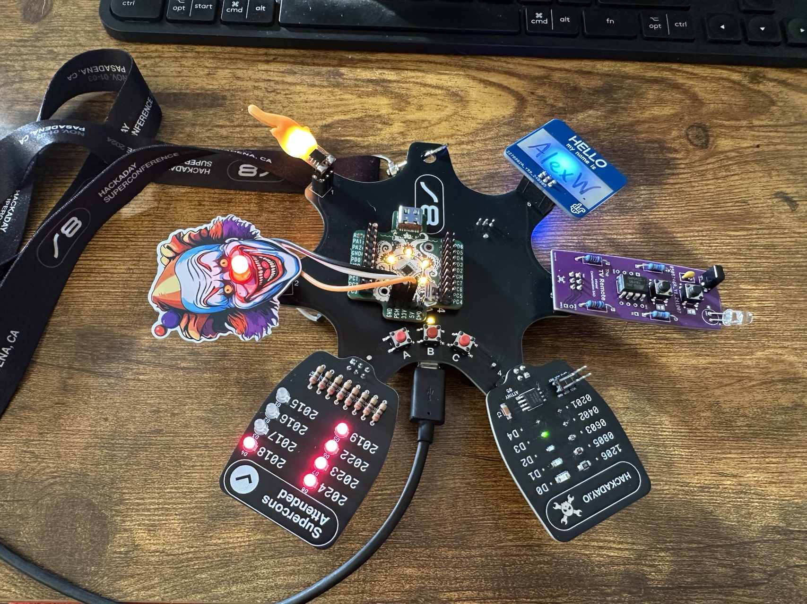

# FlipperSniffer

FlipperSniffer is my "badge hack" from Hackaday Supercon 8 in 2024.
The code herein continuously scans BLE for any device with "flipper" in the name, and blinks the clown nose SAO LED faster the better the top RSSI detected.
It will toggle the LED every 2 seconds if no flippers are detected, and in the range between 20ms and 1s for flippers with RSSI worse than -70dBm (and 20ms if greater).

The rest of the out-of-the-box badge functionality also still works, with the touch wheel and petal display, not shown.

Zero effort was put into making any of this low power or polished in any way, and MANY batteries were murdered in the process. 

The clown SAO (from [Hackerbox](https://hackerboxes.com/products/simple-add-on-kits?variant=41905954979929)) had to be modified so the LED is connected to a GPIO instead of always-on power. 

